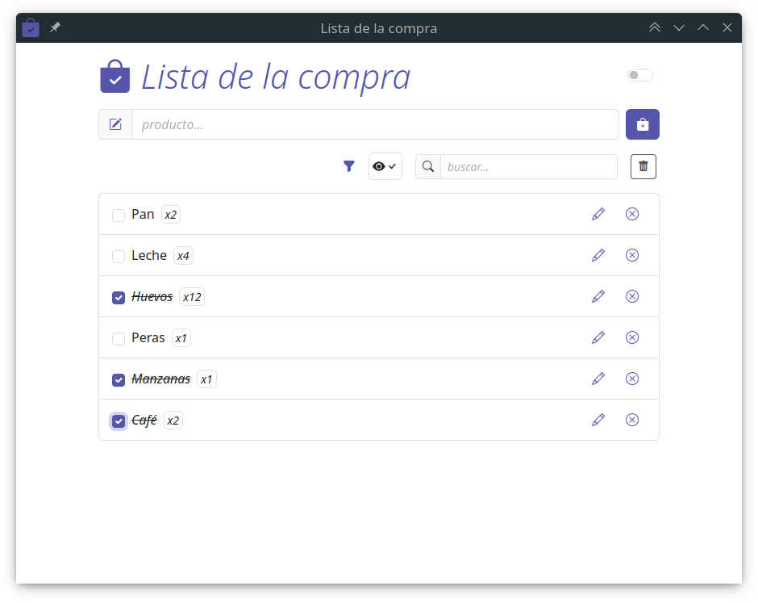
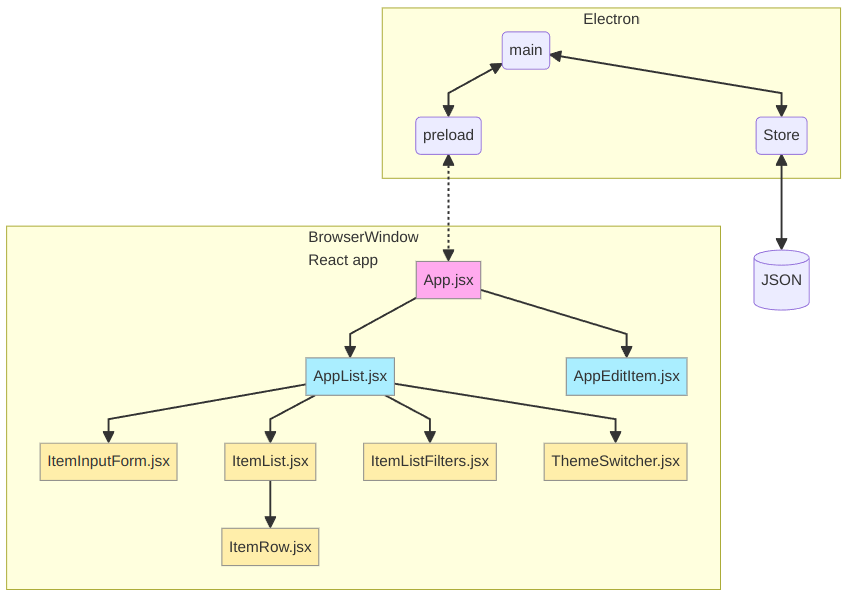

# 2DAM (semi) 2023 DIN: grocery-list-app

Aplicación de ejemplo para gestionar una lista de la compra.

Realizada con **_Electron_**, **_React_** y **_Vite_** para el módulo de **Desarrollo de Interfaces** de **2º DAM**.



## Instalación de dependencias

```bash
$ npm install
```

## Trabajar en desarrollo

```bash
$ npm run dev
```

# Estructura de la aplicación



## main/index.js

**Proceso principal** de _Electron_.

Utiliza la librería `electron-store` para almacenar los datos de la aplicación en un fichero `JSON` en el sistema de archivos del usuario.

Contiene los siguientes **eventos**:

- **`store:get-list`**. Lee del fichero JSON y envía los datos al proceso de renderizado.

- **`store:get-item`**. Busca un elemento con un ID determinado y lo envía al proceso de renderizado.

- **`store:add-item`**. Añade un elemento a la lista de la compra y lo almacena en el fichero JSON. Devuelve la lista de la compra actualizada.

- **`store:update-item`**. Edita un elemento de la lista de la compra y lo almacena en el fichero JSON. Devuelve la lista de la compra actualizada.

- **`store:delete-item`**. Elimina un elemento de la lista de la compra y lo almacena en el fichero JSON. Devuelve la lista de la compra actualizada.

- **`store:confirm-item`**. Muestra un diálogo de confirmación al descartar los cambios en un elemento. Con las opciones de guardar, descartar los cambios y cancelar la acción.

## preload/index.js

Encargado de conectar el proceso de renderizado con el proceso principal.

Expone los siguientes métodos en `window.api` que hacen las correspondientes llamadas a `ipcMain` del proceso principal:

- **`getList`**
- **`getItem`**
- **`addItem`**
- **`updateItem`**
- **`deleteItem`**
- **`confirmItem`**

# Componentes React

## App.jsx

Componente de entrada a la aplicación.

Utiliza la librería `react-router-dom` para la navegación entre componentes.

```js
import { HashRouter, Route, Routes } from 'react-router-dom'

import AppList from './AppList'
import AppEditItem from './AppEditItem'

export default function App() {
  return (
    <HashRouter>
      <Routes>
        <Route path="/" element={<AppList />} />
        <Route path="/:itemId" element={<AppEditItem />} />
      </Routes>
    </HashRouter>
  )
}
```

## AppList.jsx

Componente utilizado como **vista principal** para representar la lista de la compra, añadir nuevos elementos y filtrar contenido. Utiliza los siguientes componentes:

- ### `components/ItemInputForm.jsx`

  Formulario para añadir nuevos elementos.

- ### `components/ItemFilter.jsx`

  Permite aplicar filtros a la lista. Filtrar por nombre y mostrar/ocultar completados.

  Incluye un botón para reiniciar los filtros.

- ### `components/ItemList.jsx`

  Renderiza la lista utilizando iterando sobre los datos recibidos y renderizando un componente `ItemRow` por cada elemento.

- ### `components/ItemRow.jsx`
  
  Renderiza un elemento de la lista. Incluye un _checkbox_ para marcar el elemento como completado, un botón para editarlo y otro para eliminarlo.

## AppEditItem.jsx

Componente utilizado como vista para editar un elemento.

Está configurado con la ruta **`/:itemId`** por lo que recibe el ID del elemento a editar en la _url_.

Permite volver a la vista principal mediante un botón. Si se han realizado cambios en el elemento, muestra un diálogo de confirmación.

